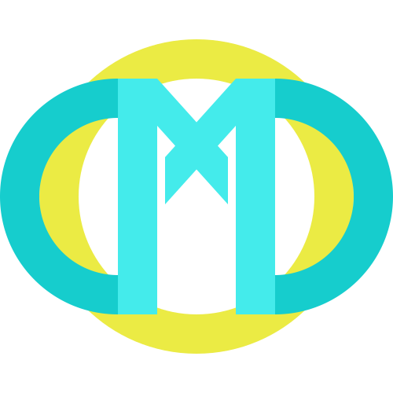

# Framework
Based on KISS philosophy, this thin framework use just TypeScript for every thing (Frontend, Backend and Testing).

Every JS Developer is just a fashion victim so for dmdcore-extended mainstream technologies as React and Express where chosen. The more is it used, the more is it tested.

## Start
Just run ```npm run init``` to perform ```npm ci``` on root and client paths.

Then use ```npm run dev``` and start working.

## Project Structure
It should be clear but:
- Frontend code is at ```./client```. This is just a React App. Structure it as you want.
- Backend code is at ```./server```
    - Endpoints are at ```./server/endpoints```. Folders path tree is used to prepare endpoints routes. Each endpoint can have any of the four CRUD methods. See ```./server/interfaces/crud-endpoints.ts```
    - For every other thing use ```./server/lib```. Structure it as you want.
    - TS is meaningless without interfaces, define them at ```./server/interfaces```


## Testing
For quality purposes, BDD testing methodology is recommended (Test only what is a business requirement or what has risks to fail).

Just run ```npm run test``` to launch following checks:

- ESLint: Basic code syntax
- Jest: Unit testing
- Cypress: End to End testing.

## About me
https://www.linkedin.com/in/dmdeveloper/